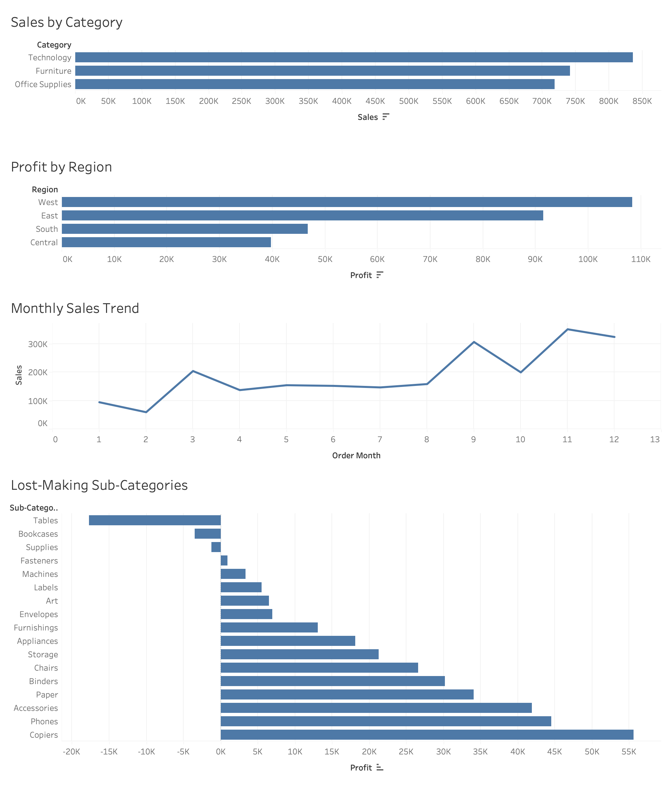

# Data Cleaning & Sales Analysis Project

## Overview
This project focuses on cleaning and analyzing a retail dataset of 9,000+ records to improve data quality and generate business insights.

## Problem
Raw business data is often messy and unstructured, making it difficult to analyze trends and make decisions.

## Solution
- Cleaned and standardized dataset using Python (pandas)
- Converted date columns into proper datetime format
- Removed duplicate records and unnecessary columns
- Created new features (order_year, order_month)

## Analysis & Insights
- Identified top-performing categories (Technology highest sales)
- Analyzed regional profitability (West region highest profit)
- Discovered underperforming sub-categories with low/negative profit
- Analyzed monthly sales trends

## Dashboard
The dashboard provides a clear visual representation of sales and profit trends.

## Tools Used
- Python (pandas)
- Tableau

## Output
- Cleaned dataset (`cleaned_sales.csv`)
- Visual dashboard for decision-making
